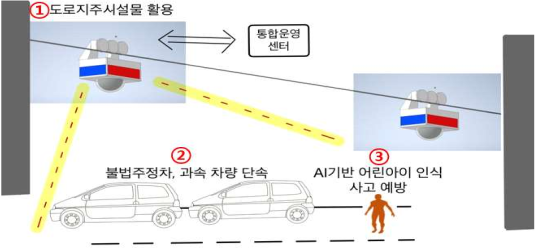
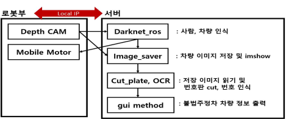

# 도로지주시설물 간 이동형 스쿨존 단속 시스템 
[ROSI 기술소개서](https://www.notion.so/eorms6199/ROSI-8728bf2e29d44542b970c5411240b7a3) / [2021 대구국제로봇산업전](http://www.irobotnews.com/news/articleView.html?idxno=26956)
> 무단횡단 경고를 위한 ROI인식
> 
> ROI내 객체 침범여부를 판별
> 
> ROS통신과 아두이노를 활용하여 센서 데이터를 입력받고 전송
> 
> SIFT, 카카오 OCR API를 사용하여 불법주정차 단속에 필요한 자동차 위치 정보와 번호판 매칭 알고리즘
> 
> 주행로봇이 커쳐야할 노드의 경로를 입력하면 그대로 노드측 터닝스테이션이 회전하도록하는 알고리즘

## Motivation
- 효율적 무인단속장비 설치비율 증가 수단 필요       
 
- 사고 사후처리가 아닌 사고 예방 수단
 
- 유동적인 무인단속장비활용으로 유지 및 보수 원활  

     

## System Architecture
 

## System Demo     
[link to demo](https://user-images.githubusercontent.com/87747013/147847494-9af16f68-0eb3-485e-bc87-15e92b871add.mp4)  

## Tech
- OPENCV
- [Introduction to SIFT](https://docs.opencv.org/3.4/da/df5/tutorial_py_sift_intro.html)
- [KAKAO- OCR API](https://developers.kakao.com/docs/latest/ko/vision/dev-guide#ocr)
- 

## Framework
- ROS melodic
## How to use?
- Remote PC
> roscore 
>
> roslaunch realsense2_camera rs_rgbd.launch
>
> rosrun rosi_controller mobile {path}
>
> rosrun image_saver image_saver_node
> 
- Pole
> rosrun rosserial_arduino serial_node.py _port:=/dev/ttyUSB0 _baud:=57600
> 
## Reference
- [Python/C API Reference Manual](https://docs.python.org/ko/3/c-api/init.html)
- [xl430-w250 e-manual](https://emanual.robotis.com/docs/kr/dxl/x/xl430-w250/#%EC%98%81%EC%97%AD-eeprom-ram)
- [ROS melodic](https://wiki.ros.org/)
- [Arduino reference](https://www.arduino.cc/reference/en/)
- 

